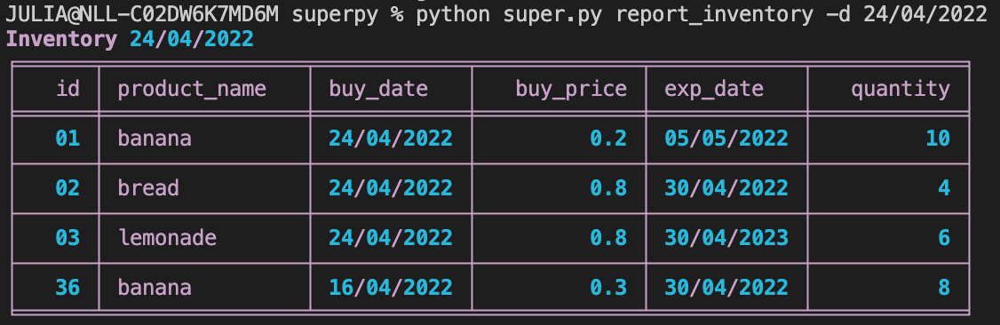
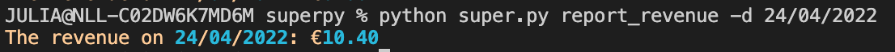

# User guide SuperPy

## Introduction
Welcome to my inventory application! In this application it possible for a supermarket to keep track of their inventory, revenue, profit, 
and even do some data analysis. All outputs are saved in csv files and can be downloaded for administrative purposes. 
In the following sections a brief summary of this application will be given. We will start with a short how to start guide. In the next section the main positional
arguments will be explained and examples will be given. Finally the extra functionalities of this application will be discussed.

<br>
<br>

# How to start?
After downloading the required files you can start from the command line by giving a specified command to call a function. 
For a overview of all the functions the command line argument is: "python super.py -h". Below you can see the output of the helpers function.
The next section will elaborate on the required input for all positional arguments.
```
SuperPy Inventory

Positional arguments:
  {advance-time,buy,sell,report_inventory,report_revenue,report_profit,revenue_graphic,profit_graphic}
    advance-time        Advance time with given amount of days
    buy                 Buy product and add to inventory
    sell                Sell product, remove from inventory and add to sold list
    report_inventory    Report inventory of entered date
    report_revenue      Report revenue of entered date
    report_profit       Report profit of entered date
    revenue_graphic     Display revenue graphic of period between 2 given dates
    profit_graphic      Display profit graphic of period between 2 given dates

Optional arguments:
  -h, --help            show this help message and exit
```

<br><br>

# Command line arguments
In this section the positional arguments and their required input will be discussed and examples will be given.
<br><br>

## buy
To add a product to the inventory.
    <br><br>
Required arguments:
- -n --name NAME OF PRODUCT
- -p --price PRICE OF PRODUCT PER UNIT
- -q --quantity HOW MANY?
- -e --exp_date EXPIRATION DATE (DD/MM/YYYY)
<br><br>
Example:
<br>
    ```
    python super.py buy -n banana -p 0.2 -q 10 -e 05/05/2022
    ```
    You've now added 10 bananas to the inventory, each cost 20 cents, they expire on the 5th of May 2022.
<br><br><br>

## sell
Remove product from inventory and add to list of sold products.
    <br><br>
Required arguments:
- -n --name NAME OF PRODUCT
- -p --price PRICE OF PRODUCT PER UNIT
- -q --quantity HOW MANY?
<br><br>
Example:
<br>
    ```
    python super.py sell -n banana -p 0.8 -q 4
    ```
    You've now removed 4 bananas from inventory and added them to the sold.csv file for 80 cents a piece.
<br><br><br>

## report_inventory
Display chart in terminal with all products in stock on certain date.<br>
If no date is given, by default the report date is current date.
    <br><br>
Optional argument:
- -d --date ANY DATE IN THE PAST (DD/MM/YYYY)
<br><br>
Example:
<br>
    ```
    python super.py report_inventory -d 24/04/2022
    ```
    A table with the inventory on April 24 will be displayed:
<br><br>

<br><br><br>

## report_revenue
Gives the revenue of any chosen date (revenue  = all sold products).<br>
If no date is given, by default the report date is current date.
    <br><br>
Optional argument:
- -d --date ANY DATE IN THE PAST (DD/MM/YYYY)
<br>
Example:
<br>
    ```
    python super.py report_revenue -d 24/04/2022
    ```
    The revenue of April 24 will be displayed:
<br><br>
    
<br><br><br>

## report profit
Gives the profit of any chosen date (profit = revenue - expanses).<br>
If no date is given, by default the report date is current date.
    <br><br>
Optional argument:
- -d --date ANY DATE IN THE PAST (DD/MM/YYYY)
<br>
Example:
<br>
    ```
    python super.py report_profit -d 24/04/2022
    ```
    The revenue of April 24 will be displayed:
<br><br>
    
<br>

<br><br><br>

# Extra functionalities

## 1. Matplotlib
<br>

### graphic_revenue
Display revenue in pop-up graphic for certain period in the past.
<br><br>
Required arguments:
- -s --start_date START DATE OF PERIOD
- -e --end_date END DATE OF PERIOD
<br>
Example:
<br>
    ```
    python super.py graphic_revenue -s 10/04/2022 -e 24/04/2022
    ```
    The revenue of every date between April 10 and April 24 will pop up.
<br><br><br>

### graphic_profit
Display profit in pop-up graphic for certain period in the past.
<br><br>
Required arguments:
- -s --start_date START DATE OF PERIOD
- -e --end_date END DATE OF PERIOD
<br>
Example:
<br>
    ```
    python super.py graphic_profit -s 10/04/2022 -e 24/04/2022
    ```
    The profit of every date between April 10 and April 24 will pop up:
<br><br><br>

## 2. Rich
All information that is returned in the terminal, is displayed in different pastel colors.<br>
This is done with the external module called [Rich](https://github.com/Textualize/rich "External module for beautiful formatting in the terminal").
